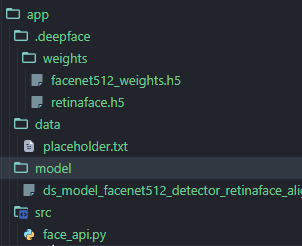

# Face recognition backend

Python backend face identifiying service built off [DeepFace](https://github.com/serengil/deepface) to recognize faces and FastAPI as an API hosting service.

Used in conjunction with [this frontend](https://github.com/seanntxj/lucky_draw_check_in_app).

# Quickstart with Python only for local testing

1. Install Python dependencies in a virtual environment.
   `python -m venv venv`
   `venv\Scripts\activate` if on Windows
   `pip install -r requirements.txt`
2. Create a folder called `faces` in the same directory as this README.md file.
3. Populate the folder with faces, folders containing IDs and names in this exact format: `<ID>+<Name>`.
   *You may use multiple images of the same person or less. Naming within doesn't matter.*

   
4. Run  `python realtimedemo.py`
   A window will show with a livefeed of your webcam. Point your webcam at a face which is in the folder "faces" should result in the folder name showing.
5. If there's an error for downloading the weights, manually get `retinaface` and `facenet512` from [here](https://github.com/serengil/deepface_models/releases/tag/v1.0). Place into `C:\Users\<YOURPCUSERNAME>\.deepface\weights`.

# Production setup

For use in combination with the [lucky_draw_check_in_app](https://github.com/seanntxj/lucky_draw_check_in_app) frontend.

## Typical flow for production use

### 1. Creating embeddings

- Populate the folder "faces" as per the instructions in the quickstart.
- Force the creation of embeddings before running `python face_api.py` (creating the model for face detection). Do this every time new faces have been added with `python create_embeddings.py`.
- The error `ValueError: Face could not be detected in numpy array.Please confirm that the picture is a face photo or consider to set enforce_detection param to False.` may be ignored. However, if `🔴 Exception while extracting faces from` is seen, it means a face can't be detected in that particular photo.
- Copy the folder model inside `faces` to another folder such as `faces_optimized`. You are not required to have all the images alongside the model in the production environment.
  
- Ensure to point the folder folder within `face_api.py` to the correct folder.
  

### 2. Allowing the endpoints on server

Modify `origins= ["http://localhost:5173", "https://seanntxj.github.io"]` in `face_api.py` to reflect your own website. `localhost:5173` should be the default Vite site link unless you've deliberately changed it, in which case you'd need to allow it through here also.

### 3. Starting the server

To start the server for use with the React + Vite frontend, run `python face_api.py`. By default it'll occupy port `8080`.

Only one POST request endpoint is exposed, `check-face`. Send a POST request with a JSON body of: `{"image": "<image_encoded_in_base64"}`.

## Docker

### Docker testing locally

1. **Prepare files**
   - Ensure to put the vectorized `.pkl` file into model inside the `app` folder.
   - Download weights `retinaface.h5` and  `facenet512_weights.h5` inside  `app/.deepface/weights`

     
2. **Build the docker image**
   `docker build -t fastapi:initial .`
3. **Run the docker image locally**
   `docker run -d --env-file .env --name fastapi-server -p 9001:9001 fastapi:initial`

### Deploying Dockerized server onto Cloud Foundry

0. **Login to Docker Hub**
   `docker login -u <DockerHubUsername> -p <DockerHubPassword>`
1. **Tag the local docker image with your Docker Hub username**
   `docker tag fastapi:initial <DockerHubUsername>/fastapi:initial`
2. **Push the image to Docker Hub**
   `docker push <DockerHubUsername>/fastapi:initial`
